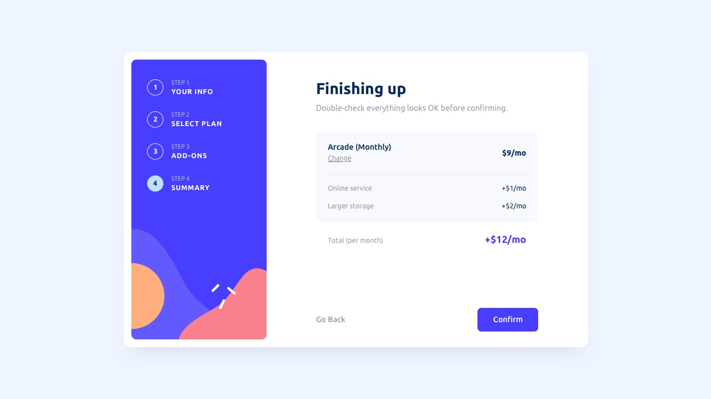
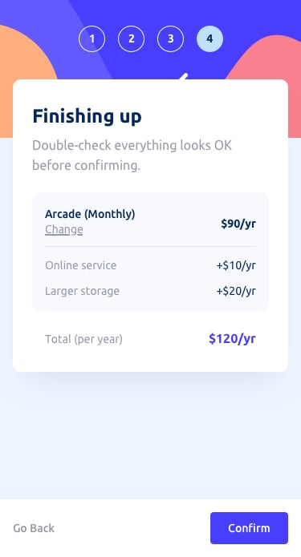

# Multi-step Form - React + Vite + shadcn/ui

This is a solution to the [Multi-step form challenge from Frontend Mentor](https://www.frontendmentor.io/challenges/multistep-form-YVAnSdqQBJ). The project is built using **React Vite** with **shadcn/ui** (includes TailwindCSS by default) to deliver a modern, responsive, and developer-friendly UI.

## 📑 Table of Contents

- [Multi-step Form - React + Vite + shadcn/ui](#multi-step-form---react--vite--shadcnui)
  - [📑 Table of Contents](#-table-of-contents)
  - [📌 Overview](#-overview)
    - [Features](#features)
    - [Screenshot](#screenshot)
  - [⚙️ Process](#️-process)
    - [Built with](#built-with)
    - [What I learned](#what-i-learned)
    - [Future development](#future-development)
  - [✍️ Author](#️-author)

---

## 📌 Overview

### Features

Users should be able to:

* Complete each step in the multi-step form.
* Go back to a previous step to update their information.
* See a summary of their input on the final step before confirmation.
* Experience an optimal layout for both mobile and desktop views.
* View hover and focus states for all interactive elements.
* Receive validation messages if:

  * A field is left empty.
  * The email format is invalid.
  * No option is selected on a required step.

### Screenshot

**Desktop**

**Mobile**

---

## ⚙️ Process

### Built with

* [React Vite](https://vitejs.dev/) - Frontend tooling
* [shadcn/ui](https://ui.shadcn.com/) - UI components
* [TailwindCSS](https://tailwindcss.com/) - Styling
* **Mobile-first workflow**

### What I learned

* Using **`position: fixed`** to keep the footer and step indicator in place across both desktop and mobile views.
* Leveraging the **`validationMessage`** property on input elements to display error messages automatically without writing extra logic.
* Implementing **responsive design** with a combination of TailwindCSS and shadcn/ui components.

### Future development

* Add backend integration to persist form data.
* Implement animated transitions between steps for better interactivity.
* Add dark mode support.

---

## ✍️ Author

* GitHub - [@nasehqusyairy](https://github.com/nasehqusyairy)
* Frontend Mentor - [@nasehqusyairy](https://www.frontendmentor.io/profile/nasehqusyairy)